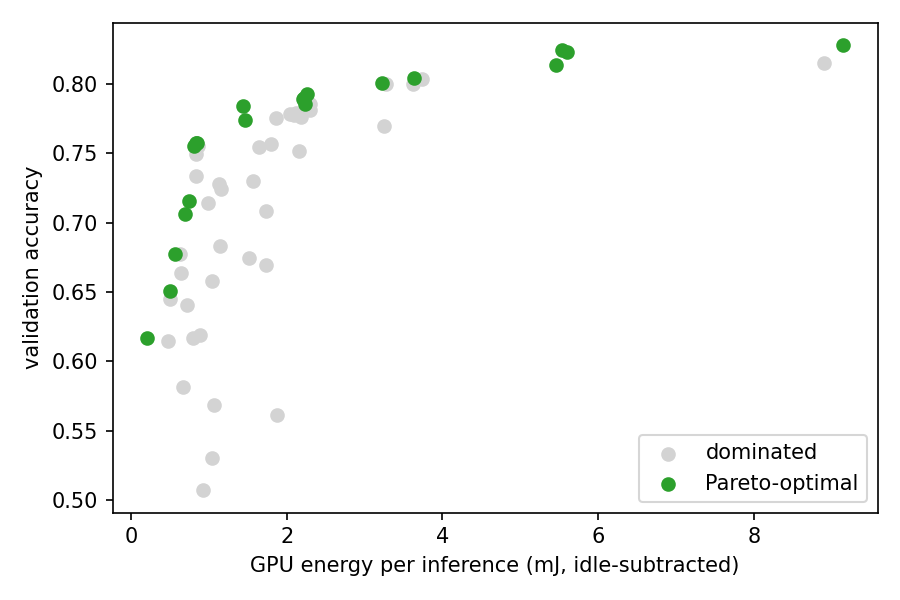
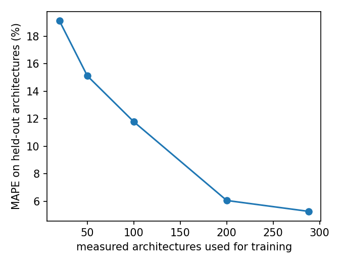
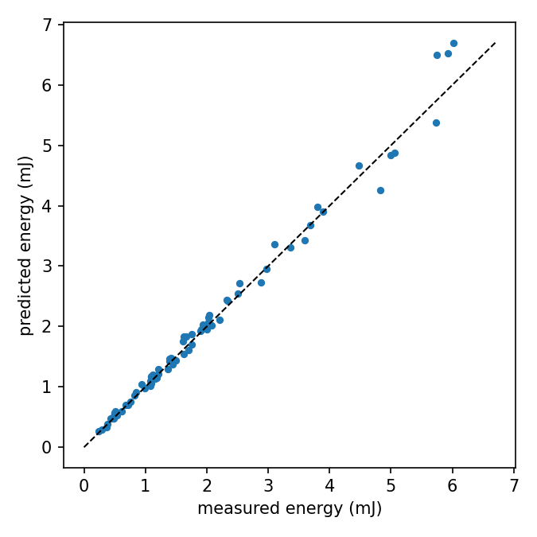

# Carbon-Aware Adaptive Neural Architecture Search

A small, fully reproducible research prototype that asks: **can we automatically build a family of CNNs with different accuracy / latency / energy trade-offs, predict their energy from architecture features, and switch between them at runtime according to latency budgets and grid carbon intensity?**

Everything here was measured on one consumer laptop GPU (RTX 3050, 4 GB, WSL2) with CIFAR-10. Scope and limitations are stated explicitly [below](#limitations-read-this-before-citing-any-number).

## Headline results

| | Result |
|---|---|
| Hardware characterization | **All 360** architectures of the search space benchmarked for GPU latency and idle-subtracted board energy: 0.24–10.4 mJ/inference (44× range); median run-to-run spread **0.7 %** (max 7.9 %) |
| Pareto model library | 6 models retrained 20 epochs: **76.0 – 90.7 %** CIFAR-10 test accuracy over a **≈39×** energy range |
| Energy predictor | Gradient boosting: **5.3 % MAPE** (R² 0.985) on 72 held-out architectures, versus 35.6 % for a MACs-only linear model |
| Runtime policy (simulation) | Carbon-aware heuristic: **−43 % carbon** vs. a latency-only policy for **−1.7 accuracy points**, <1 s total switching downtime per 24 h (synthetic carbon signal) |
| Accuracy proxy (24 random architectures) | 2-epoch vs. 8-epoch ranking: Spearman **0.99**, but only **0.74** among the top 8 |



*Accuracy is the 3-epoch validation proxy used during search. The front is computed over three objectives (error, energy, latency) and plotted in two, so some green points can look dominated.*

## Method

**Search space (360 architectures).** A compact MobileNet-style network: stem → 2–6 inverted-residual blocks (depthwise convolution; stride 2 at blocks 2 and 4) → 1×1 head → classifier. Searched: depth {2..6}, base channels {16, 24, 32, 48}, kernel {3, 5}, expansion {1, 2, 4}, internal resolution {24, 32, 40}. Inputs stay 32×32 and are resized inside the model, so "resolution" means *internal inference resolution*.

**Measurement (`measure.py`).** GPU board power is sampled through NVML (20 ms interval) while running batch-64 fp16 inference; the median over repetitions is reported (3 s × 3 repetitions during search and for the final models; 2 s × 2 repetitions for the 360-architecture benchmark). "Spread" is (max − min) / median across repetitions. Energy per inference = (mean power − idle power) × time / samples, i.e. *idle-subtracted GPU-board energy*, not whole-system energy. Idle power (~10 W) is measured once at the start of each run. Latency is per sample at batch 64; CPU latency is wall-clock at batch 1.

**Search (`nas.py`).** Optuna NSGA-II minimizing (validation error, GPU energy, GPU latency). Each candidate is trained for 3 epochs on 45 k CIFAR-10 training images and scored on 5 k held-out validation images. The 10 k test set is used only for the final models.

**Final models (`pareto.py`, `finalize.py`).** Six architectures spread along the Pareto front are retrained for 20 epochs on all 50 k training images, evaluated once on the test set, re-measured, and saved with metadata (accuracy, energy, latency, MACs, parameters, model-load switch cost).

**Energy predictor (`energy_model.py`).** All 360 architectures are measured without training (latency and energy depend on the architecture's operations and shapes, which weight values change little). A model predicts energy from architecture features (depth, width, kernel, expansion, resolution, log MACs, log parameters). 80/20 split by architecture (288 train / 72 test).

**Runtime simulation (`switcher.py`).** A 24-hour simulation (1 M requests/hour) compares policies over the model library under time-varying carbon intensity and latency budgets (strict at 08–10 h and 17–19 h). The carbon signal is **synthetic**.

## Results

### Model library

<!-- MODELS_TABLE_START -->
Run `python make_results_table.py` to fill this table from `models/*/metadata.json`.
<!-- MODELS_TABLE_END -->

### Energy predictor (72 held-out architectures)

| Model | MAE (mJ) | RMSE (mJ) | NMAE | MAPE | R² |
|---|---:|---:|---:|---:|---:|
| Linear (MACs only) | 0.387 | 0.499 | 19.8 % | 35.6 % | 0.889 |
| Linear (all features) | 0.470 | 0.563 | 24.0 % | 53.6 % | 0.858 |
| **Gradient boosting** | **0.107** | **0.183** | **5.5 %** | **5.3 %** | **0.985** |

Median measurement spread across the 360 benchmarks is 0.7 %, well below the predictor error.

|  |  |
|---|---|

Error falls from 19.1 % (20 training architectures) to 15.1 % (50), 11.8 % (100), 6.1 % (200) and 5.3 % (288). It is a single train/test split; `energy_curve_repeats.py` repeats it over 20 splits with error bands.

### Runtime policies (simulation, synthetic carbon signal, 24 M requests/day)

| Policy | Mean accuracy | Energy (J) | Carbon (mg CO₂) | vs. largest | Latency-budget violations | Switches |
|---|---:|---:|---:|---:|---:|---:|
| always largest | 90.7 % | 207,517 | 15,831 | – | 16.7 % | 0 |
| always smallest | 76.0 % | 5,293 | 404 | −97.4 % | 0 % | 0 |
| latency-only | 90.1 % | 182,170 | 13,780 | −13.0 % | 0 % | 4 |
| energy-aware | 86.8 % | 52,031 | 3,954 | −75.0 % | 0 % | 4 |
| carbon-aware heuristic | 88.5 % | 117,100 | 7,851 | −50.4 % | 0 % | 5 |

Always-largest violates the strict-hour latency budget, so the fair reference is **latency-only**: the carbon-aware heuristic uses 43 % less carbon for 1.7 fewer accuracy points. The energy-aware policy has lower carbon but also lower accuracy; the two sit at different points of the trade-off. Whether carbon-awareness beats energy-awareness **at equal accuracy** has not been established; `policy_sweep.py` sweeps both policies' accuracy tolerance to test exactly that.

### Proxy reliability (n = 24)

24 random architectures were each trained twice from scratch, for 2 and for 8 epochs (45 k train / 5 k validation; test set untouched).

| Measure | Value |
|---|---|
| Spearman, all 24 architectures | 0.986 (bootstrap 95 % CI 0.94–1.00) |
| Kendall τ | 0.935 |
| Best architecture by 2-epoch accuracy is also best at 8 epochs | yes (regret 0) |
| Best 5 at 8 epochs found within the top 10 at 2 epochs | 5 / 5 |
| Largest rank displacement | 3 places (mean 0.75) |
| Spearman among the top 12 / top 8 (by 8-epoch accuracy) | 0.90 / 0.74 |
| Close pairs (8-epoch accuracy within 2 points) ordered correctly by the 2-epoch proxy | 28 of 37 (76 %) |

The cheap proxy separates weak from strong architectures reliably, but it is noticeably less reliable among strong, similar candidates, which are the ones that matter on a Pareto front. Caveats: random architectures span a wide accuracy range (which flatters the overall correlation); the study compares 2 vs 8 epochs, whereas the search used 3 epochs and the final models 20; one training seed per architecture, so repeat-training noise is not estimated.

## Limitations (read this before citing any number)

- **Energy is GPU-board energy only**, from NVML, minus an idle baseline measured once per run. It excludes CPU, memory, display and the rest of the system. CPU energy is not measured (WSL2 has no RAPL).
- **Energy and latency are almost redundant here.** Across the 360 architectures their correlation is 0.9985 (active power only 2.5–3.3 W above idle). The three-objective search therefore behaves much like a two-objective one, and the energy predictor largely predicts latency. On other hardware or with other kernels this may differ.
- **The search was small and repetitive.** 60 trials evaluated only 41 distinct architectures; the 20 non-dominated trials are 12 distinct architectures (NSGA-II re-sampled the best ones). With only 360 architectures in the space, exhaustive evaluation is feasible and would give the true front.
- **Search accuracy is a 3-epoch proxy.** In a 24-architecture study the 2-epoch ranking agreed well overall (Spearman 0.99) but less among the strongest candidates (0.74 for the top 8), so similar Pareto candidates can be mis-ranked. The final models are retrained for 20 epochs, but the selection itself used the proxy.
- **The runtime part is a simulation.** The carbon signal is synthetic; latency budgets are assumed; the carbon-aware policy is a hand-designed threshold rule, not an optimal controller. "Switch cost" is local model reload on one GPU (construct + load weights + warm-up), **not** workload migration across machines.
- **Single dataset, single GPU, small models.** Per-request energy is micro- to milli-joules; relative differences, not absolute carbon figures, are the meaningful output.

## Reproduce

```bash
python3 -m venv venv && source venv/bin/activate
pip install torch torchvision && pip install -r requirements.txt
python measure.py --check              # verify NVML power readout works (native Windows Python if WSL fails)

python energy_model.py --n 360         # benchmark all 360 architectures + fit energy predictors
python nas.py --trials 60 --epochs 3   # multi-objective search
python pareto.py --k 6                 # Pareto front + selection
python finalize.py --epochs 20         # retrain, test, measure, save models/ + metadata
python switcher.py                     # runtime simulation
python make_results_table.py           # fill the model table above
python energy_curve_repeats.py         # learning curve over 20 splits
python policy_sweep.py                 # carbon-aware vs energy-aware at equal accuracy
python proxy_study.py --n 24 --short 2 --long 8   # proxy reliability (resumable); outputs results/proxy_study*.json/png
```

`run_overnight.sh` runs the main steps sequentially. Keep the laptop plugged in, avoid other GPU work during measurement, and expect the full pipeline to take many hours.

## Repository layout

```
common.py      search space, model, MAC counter, data/training helpers
measure.py     NVML power + latency measurement
nas.py         NSGA-II search          pareto.py       front + selection
finalize.py    final training + model library with metadata
energy_model.py / energy_curve_repeats.py   energy predictor and learning curves
switcher.py / policy_sweep.py               runtime policies and fair comparison
proxy_study.py proxy-accuracy reliability study
results/       figures and JSON/CSV outputs      models/   library (weights + metadata)
```

## Roadmap

1. Train all 360 architectures to obtain the true Pareto front, then measure how many search trials NSGA-II (and a predictor-assisted variant) needs to recover it.
2. Validate the proxy in the search's own setting (3 vs 20 epochs), among near-equal Pareto candidates and with repeated seeds.
3. Replace the synthetic signal with real grid carbon-intensity data.
4. Move the switcher from simulation to a networked service across more than one node.

## Development notes

I designed the experiments, ran all training and measurements on my own hardware, and analysed the results. An AI assistant helped draft parts of the code and documentation.

## Author

Mohamed Guechaoui, École Supérieure en Informatique (ESI), Sidi Bel Abbès. Contact: m.guechaoui@esi-sba.dz